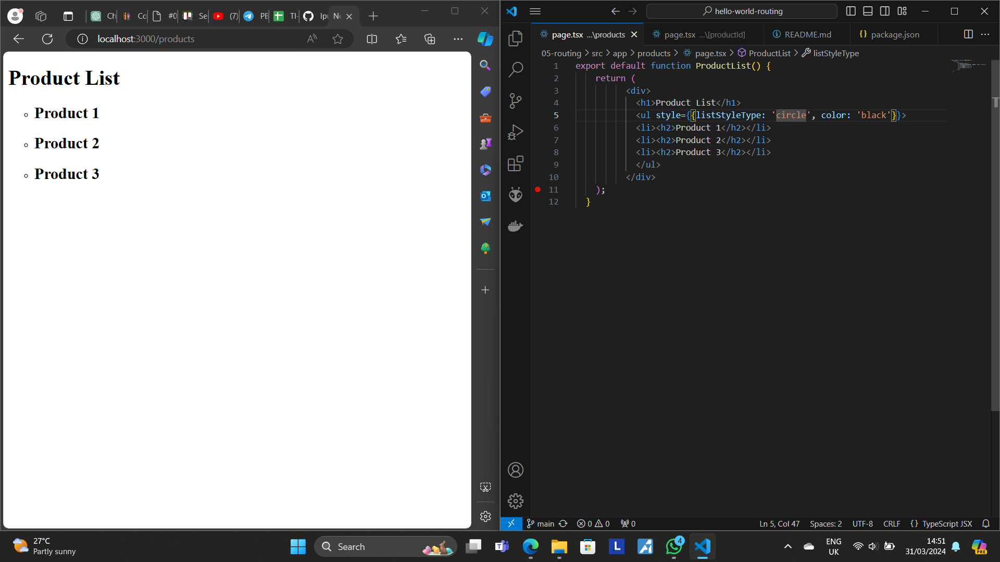
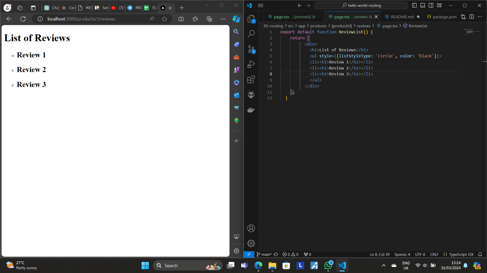
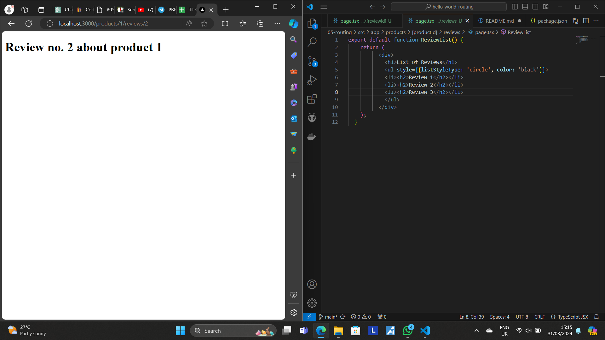
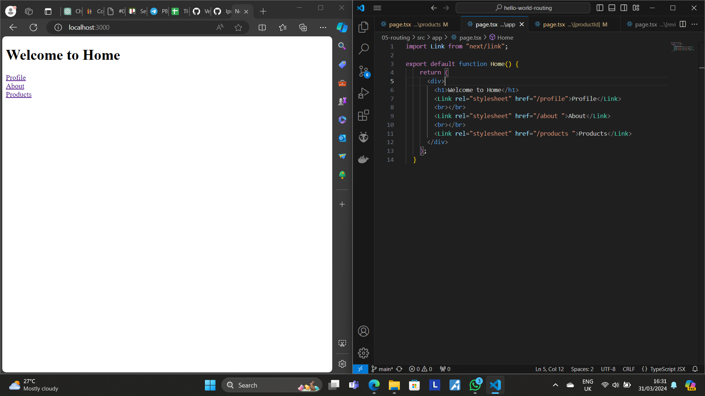
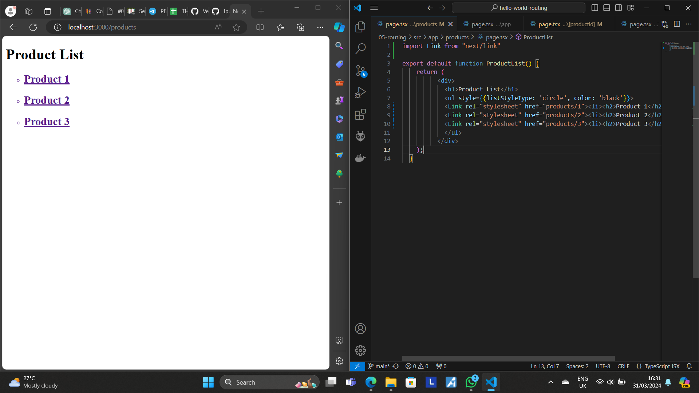
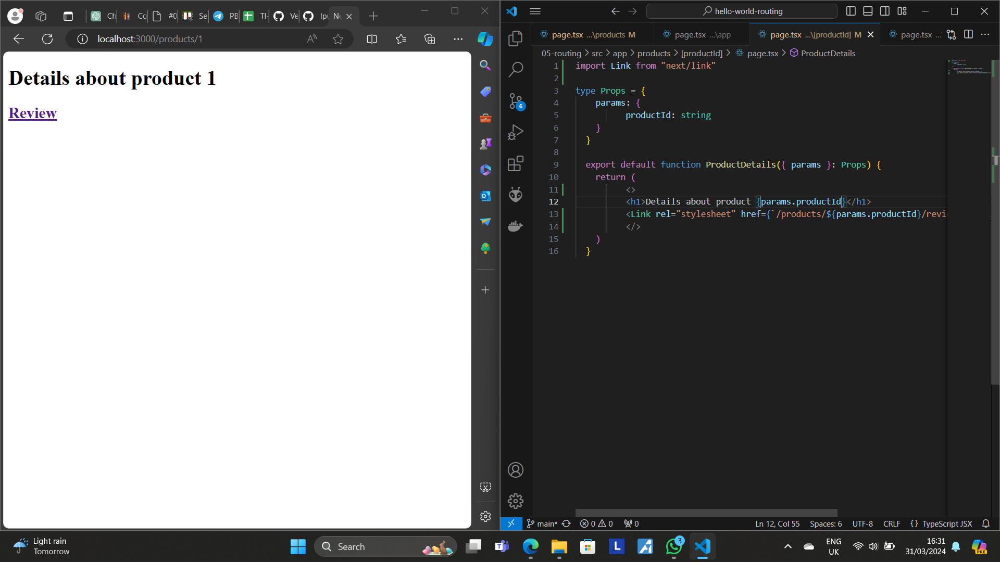
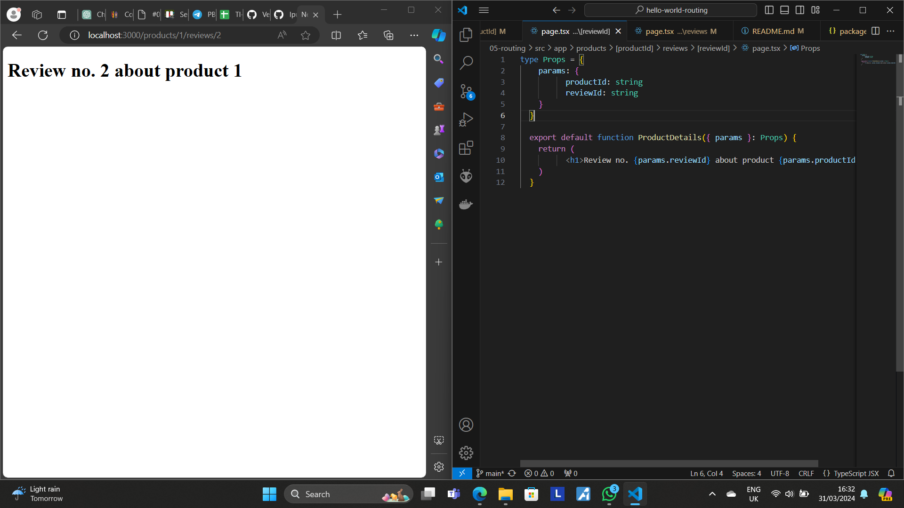

This is a [Next.js](https://nextjs.org/) project bootstrapped with [`create-next-app`](https://github.com/vercel/next.js/tree/canary/packages/create-next-app).

## Getting Started

First, run the development server:

```bash
npm run dev
# or
yarn dev
# or
pnpm dev
# or
bun dev
```

Open [http://localhost:3000](http://localhost:3000) with your browser to see the result.

You can start editing the page by modifying `app/page.tsx`. The page auto-updates as you edit the file.

This project uses [`next/font`](https://nextjs.org/docs/basic-features/font-optimization) to automatically optimize and load Inter, a custom Google Font.

## Practicum 1

This practicum goes through the way of how to make a simple router on Next.js. We begin by cloning a Github repository and running it on a local development server. Then, we make "home" and "about" page, continued by making "profile" page. The code and the result is as follows. 

Codes: 


Output: 


## Practicum 2

This practicum tackles the problem of nested routing. This is done if a link is clicked on a website it will direct the user to the page inside the nested route. The content of the website could be represented in the following screenshots. 

Codes: 


Output: 


## Practicum 3

In this practicum, we learned about dynamic routing. Dynamic routing means that any parameter displayed on the website can be changed based on the input/modification made to the URL. An example of it could be seen below. 




An additional review page is added for each product by using nested and dynamic routing. 





## Practicum 4

In this practicum, we will add navigation to the various pages using link component. It is one way for users to navigate our website easily. The code will be demonstrated as follows: 

1. Start from home page



2. Navigate to product page



3. Go to the product details using [productId] parameter



4. Go to review of said product


5. Navigate to a particular review by using [reviewId] parameter

